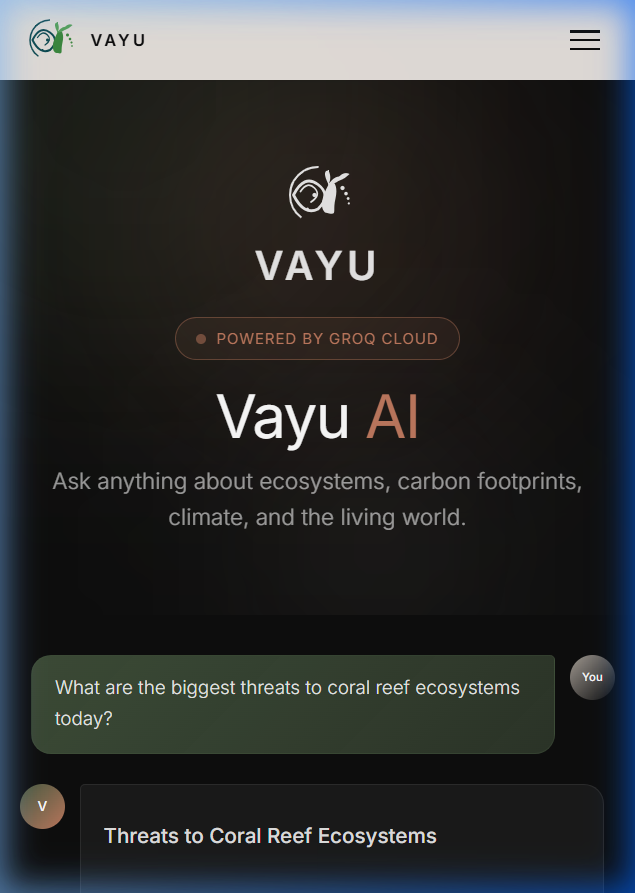

# VAYU — Carbon Footprint Awareness Platform

> *"Balance Your Breath. Balance the Atmosphere."*

VAYU is a state-of-the-art, responsive web application focused on carbon footprint awareness, ecosystem preservation, and climate storytelling. It features fluid, modern parallax animations, professional environmental photography, and a dynamic AI assistant.

---

## 📸 Visual Showcase

### 1. Home Dashboard


### 2. Nature Reserve & Conservation Slider


### 3. Vayu AI Assistant (Powered by Groq / Gemini)


---

## 🌟 Core Features

- **Immersive Design**: Sleek typography, curated Earth-harmonic color palette, micro-animations, and parallax scrolling.
- **Ecosystem Stories**: Fully realized narrative articles about rewilding, mangroves, ocean protection, and carbon capture.
- **Vayu AI**: Intelligent assistant that automatically routes queries between **Groq Cloud (Llama 3.3)** and **Google Gemini**, with a built-in offline fallback database to prevent service disruption when keys are out of quota.
- **Integrated Contact & Socials**: Connected directly to Gmail via **Web3Forms API** (with local mailto client fallbacks) and custom Instagram endpoints.

---

## 🛠️ Tech Stack

- **Core**: React 19, TypeScript, Vite
- **Styling**: Vanilla CSS, TailwindCSS, custom Glassmorphism components
- **Animations**: GSAP, Lenis Smooth Scroll
- **Icons & Graphics**: Lucide React, Custom SVGs
- **Deployment**: Google Cloud Run, Docker, Cloud Build

---

## 🚀 Local Setup & Installation

1. **Clone the repository**:
   ```bash
   git clone <repository-url>
   cd "Prompt war project 3"
   ```

2. **Install dependencies**:
   ```bash
   npm install
   ```

3. **Configure Environment Variables**:
   Create a `.env` file in the root directory:
   ```ini
   VITE_GEMINI_API_KEY=gsk_your_groq_key_or_gemini_key
   VITE_CONTACT_EMAIL=your.email@gmail.com
   VITE_INSTAGRAM_URL=https://instagram.com/your_username
   VITE_WEB3FORMS_KEY=your_web3forms_access_key
   ```

4. **Start the local server**:
   ```bash
   npm run dev
   ```
   *Your site will be running at [http://localhost:3000](http://localhost:3000).*

---

## ☁️ Google Cloud Deployment (Cloud Run)

The repository is pre-configured with a production-grade multi-stage `Dockerfile`, custom `nginx.conf` (with single-page application routing protection), and `cloudbuild.yaml` automated pipelines.

To build, register, and deploy your site in one command, run:

```bash
gcloud builds submit --config=cloudbuild.yaml \
  --substitutions=\
_VITE_GEMINI_API_KEY="your_api_key",\
_VITE_CONTACT_EMAIL="your.email@gmail.com",\
_VITE_INSTAGRAM_URL="https://instagram.com/your_handle",\
_VITE_WEB3FORMS_KEY="your_web3forms_key"
```
